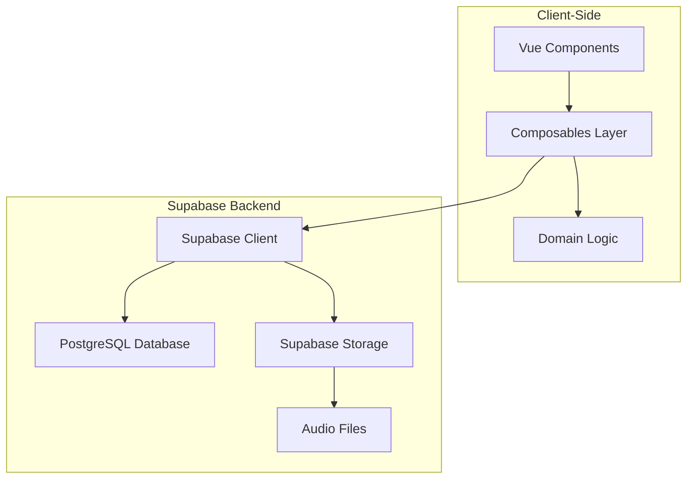

# Design Document

## Overview

The Vocabulary & Flashcards feature implements a spaced repetition system (SRS) for Tagalog language learning within the Nuxt 4 + Supabase architecture. The system uses a simplified SM-2 algorithm to optimize review intervals and provides an intuitive flashcard interface with optional audio playback.

The **Vocabulary & Flashcards** feature implements a spaced repetition system (SRS) for Tagalog language learning within the **Nuxt 4 + Supabase** architecture. The system uses a simplified SM-2 algorithm to optimize review intervals and provides an intuitive flashcard interface with optional audio playback.

## Architecture

### High-Level Architecture



### Data Flow

1. **Study Session**: User selects category → Load due cards → Present flashcard → Collect review → Update SRS data
2. **Progress Sync**: Local state → Supabase real-time → Cross-device synchronization
3. **Audio Playback**: Request audio URL → Supabase Storage → Browser audio API

## Components and Interfaces

### Vue Components

#### `VocabularyDashboard.vue`

- Displays vocabulary categories and progress overview
- Shows daily review count and streak information
- Navigation to different study modes

#### `FlashcardStudy.vue`

- Main study interface with card presentation
- Handles card flipping animations and review buttons
- Manages study session state and progress

#### `FlashcardComponent.vue`

- Individual flashcard display with flip animation
- Audio playback controls
- Responsive design for mobile and desktop

#### `ProgressStats.vue`

- Visual progress indicators and statistics
- Charts showing learning trends and accuracy
- Achievement badges and streak counters

### Composables

#### `useVocabularyStudy.ts`

```typescript
interface StudySession {
  categoryId: string
  dueCards: FlashcardData[]
  currentIndex: number
  sessionStats: SessionStats
}

interface ReviewResult {
  cardId: string
  quality: 1 | 3 | 4 | 5 // Again, Hard, Good, Easy
  responseTime: number
  timestamp: Date
}

export function useVocabularyStudy() {
  const startSession = (categoryId: string) => Promise<StudySession>
  const submitReview = (result: ReviewResult) => Promise<void>
  const getNextCard = () => FlashcardData | null
  const endSession = () => Promise<SessionStats>
}
```

#### `useSpacedRepetition.ts`

```typescript
export function useSpacedRepetition() {
  const calculateNextReview = (review: Review, quality: number) => Review
  const getDueCards = (categoryId?: string) => Promise<FlashcardData[]>
  const updateCardProgress = (userId: string, wordId: string, quality: number) => Promise<void>
  const initializeNewCard = (userId: string, wordId: string) => Promise<Review>
}
```

#### `useAudioPlayback.ts`

```typescript
export function useAudioPlayback() {
  const playAudio = (audioUrl: string) => Promise<void>
  const isPlaying = ref(false)
  const currentAudio = ref<HTMLAudioElement | null>(null)
  const stopAudio = () => void
}
```

### Domain Logic

#### `app/domain/vocabulary/spacedRepetition.ts`

- Pure SRS algorithm implementation (SM-2 variant)
- Card scheduling calculations
- Progress metrics computation

#### `app/domain/vocabulary/flashcardLogic.ts`

- Flashcard data transformation
- Study session management logic
- Statistics calculation

## Data Models

### Database Schema

#### `categories` Table

```sql
CREATE TABLE IF NOT EXISTS categories (
  id UUID PRIMARY KEY DEFAULT gen_random_uuid(),
  name TEXT NOT NULL,
  description TEXT,
  sort_order INT DEFAULT 0,
  created_at TIMESTAMPTZ DEFAULT NOW()
);
```

#### `words` Table

```sql
CREATE TABLE IF NOT EXISTS words (
  id UUID PRIMARY KEY DEFAULT gen_random_uuid(),
  category_id UUID NOT NULL REFERENCES categories(id) ON DELETE CASCADE,
  tl TEXT NOT NULL,               -- Tagalog
  en TEXT NOT NULL,               -- English
  created_at TIMESTAMPTZ DEFAULT NOW()
);
```

#### `examples` Table

```sql
CREATE TABLE IF NOT EXISTS examples (
  id UUID PRIMARY KEY DEFAULT gen_random_uuid(),
  word_id UUID NOT NULL REFERENCES words(id) ON DELETE CASCADE,
  tl TEXT NOT NULL,               -- example sentence (Tagalog)
  en TEXT NOT NULL,               -- translation
  audio_url TEXT,                 -- Supabase Storage path
  created_at TIMESTAMPTZ DEFAULT NOW()
);
```

#### `reviews` Table

```sql
CREATE TABLE IF NOT EXISTS reviews (
  user_id UUID NOT NULL REFERENCES auth.users(id) ON DELETE CASCADE,
  word_id UUID NOT NULL REFERENCES words(id) ON DELETE CASCADE,
  ease REAL DEFAULT 2.5,
  interval_days INT DEFAULT 0,
  reps INT DEFAULT 0,
  lapses INT DEFAULT 0,
  next_due DATE DEFAULT NOW(),
  last_reviewed DATE,
  PRIMARY KEY (user_id, word_id)
);
```

#### Database Indexes

```sql
CREATE INDEX IF NOT EXISTS reviews_user_due_idx ON reviews (user_id, next_due);
CREATE INDEX IF NOT EXISTS words_category_idx ON words (category_id);
CREATE INDEX IF NOT EXISTS examples_word_idx ON examples (word_id);
  cards_studied INTEGER DEFAULT 0,
  correct_answers INTEGER DEFAULT 0,
  session_duration_seconds INTEGER,
  started_at TIMESTAMP WITH TIME ZONE DEFAULT NOW(),
  completed_at TIMESTAMP WITH TIME ZONE
);
```

### TypeScript Interfaces

```typescript
interface Category {
  id: string
  name: string
  description?: string
  sortOrder: number
  createdAt: Date
  wordCount?: number
  dueCount?: number
}

interface Word {
  id: string
  categoryId: string
  tl: string  // Tagalog
  en: string  // English
  createdAt: Date
}

interface Example {
  id: string
  wordId: string
  tl: string      // Tagalog example sentence
  en: string      // English translation
  audioUrl?: string
  createdAt: Date
}

interface Review {
  userId: string
  wordId: string
  ease: number
  intervalDays: number
  reps: number
  lapses: number
  nextDue: Date
  lastReviewed?: Date
}

interface FlashcardData extends Word {
  examples: Example[]
  review?: Review
  category: Category
}

interface StudySessionStats {
  cardsStudied: number
  correctAnswers: number
  accuracy: number
  sessionDuration: number
  newCardsLearned: number
}
```

## Error Handling

### Client-Side Error Handling

1. **Network Errors**: Offline support with local storage fallback
2. **Audio Playback Errors**: Graceful degradation to text-only mode (audio is optional)
3. **Sync Conflicts**: Last-write-wins with user notification
4. **Invalid Data**: Input validation and sanitization

### Error Recovery Strategies

```typescript
// Offline study support
const useOfflineStudy = () => {
  const syncWhenOnline = () => {
    // Queue local changes for sync when connection restored
  }
  
  const handleSyncConflict = (localData: any, serverData: any) => {
    // Merge strategies for conflicting progress data
  }
}
```

### User Experience Error Handling

- **Loading States**: Skeleton screens during data fetching
- **Empty States**: Helpful messages when no cards are due
- **Error Messages**: Clear, actionable error descriptions
- **Retry Mechanisms**: Automatic retry with exponential backoff

## Testing Strategy

### Unit Testing

1. **Domain Logic Tests**
   - SRS algorithm correctness
   - Progress calculation accuracy
   - Card scheduling logic

2. **Composable Tests**
   - State management behavior
   - API integration mocking
   - Error handling scenarios

### Integration Testing

1. **Database Operations**
   - CRUD operations for all tables
   - Real-time subscription behavior
   - Data consistency checks

2. **Audio Playback**
   - File loading and playback
   - Error handling for missing files
   - Cross-browser compatibility

### End-to-End Testing

1. **Study Flow**
   - Complete study session workflow
   - Progress persistence across sessions
   - Cross-device synchronization

2. **Performance Testing**
   - Large vocabulary set handling
   - Audio loading optimization
   - Real-time update responsiveness

### Test Data Strategy

```typescript
// Test fixtures for consistent testing
const mockVocabularyData = {
  categories: [
    { id: '1', name: 'Greetings', wordCount: 10 },
    { id: '2', name: 'Food', wordCount: 25 }
  ],
  words: [
    {
      id: '1',
      tagalogWord: 'Kumusta',
      englishTranslation: 'How are you?',
      categoryId: '1'
    }
  ]
}
```

## Performance Considerations

### Database Optimization

1. **Indexing Strategy**
   - Index on `user_id, next_due` for due card queries
   - Index on `category_id` for category-based filtering
   - Composite index on `user_id, word_id` for progress lookups

2. **Query Optimization**
   - Batch card updates to reduce database calls
   - Use Supabase RPC for complex SRS calculations
   - Implement pagination for large vocabulary sets

### Client-Side Performance

1. **Audio Preloading**
   - Preload next card's audio during current card study
   - Implement audio caching strategy
   - Lazy load audio files based on study session

2. **State Management**
   - Minimize reactive state updates
   - Use computed properties for derived data
   - Implement virtual scrolling for large lists

### Real-time Optimization

1. **Selective Subscriptions**
   - Subscribe only to user's active study data
   - Unsubscribe from channels when not needed
   - Batch real-time updates to prevent UI thrashing

## Security Considerations

### Row Level Security (RLS)

```sql
-- Users can only access their own reviews
CREATE POLICY "Users can view own reviews" ON reviews
  FOR SELECT USING (auth.uid() = user_id);

CREATE POLICY "Users can update own reviews" ON reviews
  FOR ALL USING (auth.uid() = user_id);

-- Vocabulary data is read-only for all authenticated users
CREATE POLICY "Authenticated users can view categories" ON categories
  FOR SELECT TO authenticated USING (true);

CREATE POLICY "Authenticated users can view words" ON words
  FOR SELECT TO authenticated USING (true);

CREATE POLICY "Authenticated users can view examples" ON examples
  FOR SELECT TO authenticated USING (true);
```

### Data Validation

1. **Input Sanitization**: Validate all user inputs on client and server
2. **Progress Integrity**: Validate SRS calculations to prevent manipulation
3. **Audio Security**: Validate audio file types and sizes
4. **Rate Limiting**: Implement study session rate limits to prevent abuse
